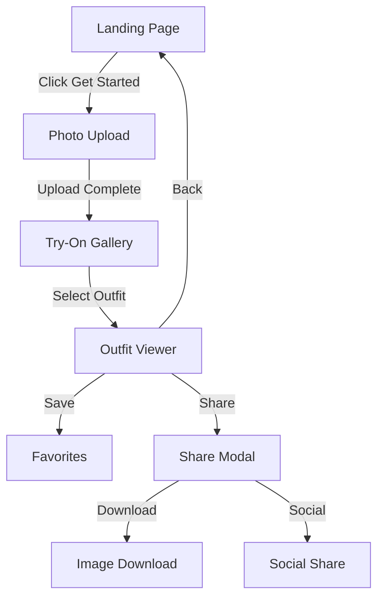

# User Flow Graph

## Route Mapping

| Path | Component | File | Guards | Exit Points |
|------|-----------|------|--------|-------------|
| / | Home / | src/App.jsx | - | - |
| /try-on | TryOn / | src/App.jsx | - | - |
| /admin | Admin / | src/App.jsx | - | - |

## Key User Flows

### Primary Flow: Photo Upload → Try-On → Share
1. **Landing (/)**: User sees hero, clicks "Get Started"
2. **Photo Upload**: User uploads photo, stored in Zustand + localStorage
3. **Try-On (/try-on)**: 
   - Guard: Redirects to / if no userPhoto
   - Loads outfit catalog
   - Applies outfit overlay via AI processing
4. **Outfit Selection**: User browses carousel, selects outfit
5. **Save/Share**: User saves to favorites or opens share modal
6. **Share Modal**: User downloads image or shares to social

### Drop-off Risk Points
- **Photo Upload**: File validation, size limits (10MB)
- **AI Processing**: Async outfit overlay - can be slow
- **Try-On Load**: No loading state if outfits not loaded
- **Share Modal**: No server-side click tracking

